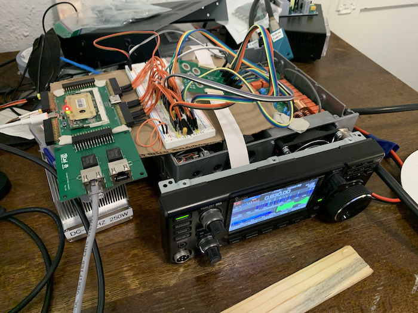

About
-----

Great Northern Circuits, LLC is a Minnesota based company formed by KE0PSL.
It's purpose is to develop and sell the DE7301, develop ham radio hardware and software, 
develop low power electronics and other hobby electronics.

The DE7301 has been a part-time project for over a year. Viability of the concept was proven in 
October of 2021 and has been refined since that time.

    Early proof of concept prototype

..  figure:: img/beta_unit.jpg
    :target: ./_static/beta_unit_large.jpg

    Beta Unit