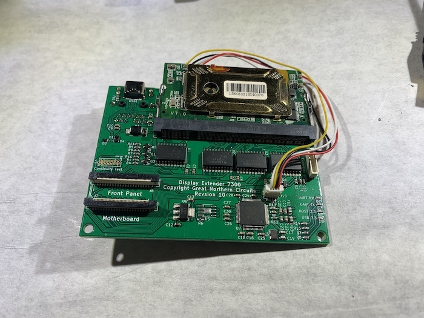

.. DE7301 documentation master file, created by
   sphinx-quickstart on Tue Jan 10 21:14:48 2023.
   You can adapt this file completely to your liking, but it should at least
   contain the root `toctree` directive.

DE7301 Introduction
==================================

.. raw:: html

    <iframe id="ytplayer" type="text/html" width="640" height="360"
    src="https://www.youtube.com/embed/1HstbYwh1uc?autoplay=0"
    frameborder="0"></iframe>

The Display Extender 7301 (DE7301) is a no-soldering, reversible kit for the Icom IC-7300 which creates a virtual radio front panel
on your Mac or PC, capturing real time pixel perfect 60FPS video from your radio.
This is done by adding an Ethernet connection to your radio; it does not use the radio's USB port. 

Being a no-solder kit, the :doc:`installation <installation>` takes approximately an hour and
requires minimal tooling (screwdriver, multimeter). Also required is
patience, a delicate touch, good lighting, and possibly magnification.

Installed between the Front Unit (Display) and the Main Unit (processor board),
the DE7301 monitors the display data and multiplexes
physical controls with virtual ones. :doc:`Both the physical and virtual elements work simultaneously <shared_state>`,
and the user experience at the radio is unchanged.

The DE7301 Hardware and DE7301 Application do not require any 'cloud' services or monthly subscriptions to function. 
Great Northern Circuits, LLC does not offer any subscription based services.

The DE7301 can operate in two different network access modes:

* :doc:`LAN Local Mode. <remote>`

  * Prioritizes lowest possible latency from the IC7300 to your Mac/PC
  * Display timing is exactly locked to radio's display 
  * Utilizes enormous network bandwidth (130Mbit/s)
  * Only suitable for a local LAN
* :doc:`Proxy Mode <remote>`. 

  * Prioritizes lossless compression of the signal.
  * Utilizes low bandwidth (Less than 5Mbit/s)
  * Suitable for remote connections over the internet, or over WiFi
  * Display timing is unlocked
  * Requires a PC to run proxy software
  

Check out the :doc:`Getting Started <getting_started>` Guide for more.

    Beta Unit

Features
++++++++

The hardware adds two new ports to your radio.

* Gigabit Ethernet: Secure control and realtime streaming of the display.
* USB-C: Firmware updates, settings, and power (5V DC).

The software's major features include:

* Displaying a resizable copy of the radio screen in real time.
* Ability to click the touch screen with a mouse.
* Controls to adjust the VFO, Volume, Multi, Band Pass, RF/Squelch dials.
* :doc:`Secured by default <security>`, using industry standard protocols (TLSv1.2).
* :doc:`Record the screen to an .mp4 (h264) <save_mp4>` for editing in other software.
* :doc:`Javascript based API <api>`, allowing custom macros/scripts on the front panel.
* Support for MIDI "DJ Controllers" for additional external dials (Such as VFO) and buttons.

Hardware
++++++++

The kit includes:

* Assembled and tested unit.
* Cables for internal radio connections.
* The 3D printed parts:

  * Mounting Bracket.
  * Fan Spacer.

Beta kits do NOT include, but are available for purchase:

* USB-C Cable
* Ethernet Cable

  * Pre-terminated ethernet cables will not fit through the IC7300 housing, except for a limited few specifically sold here.
  * If you do not purchase one, you must be able to crimp your own. This is the recommended approach.

* USB-C Power Supply

.. note::

   DO NOT EXCEED 5.5V ON THE USB-C POWER SUPPLY.

   Equipment damage will occur if this maximum is exceeded.

   Under no circumstances apply 12VDC to the DE7301

.. toctree::
   :maxdepth: 3
   :caption: Contents:

   getting_started.rst
   installation.rst
   faq.rst
   remote.rst
   security.rst
   save_mp4.rst
   shared_state.rst
   troubleshooting.rst
   api.rst
   settings.rst
   usb.rst
   usb_driver.rst
   operation.rst
   about.rst
